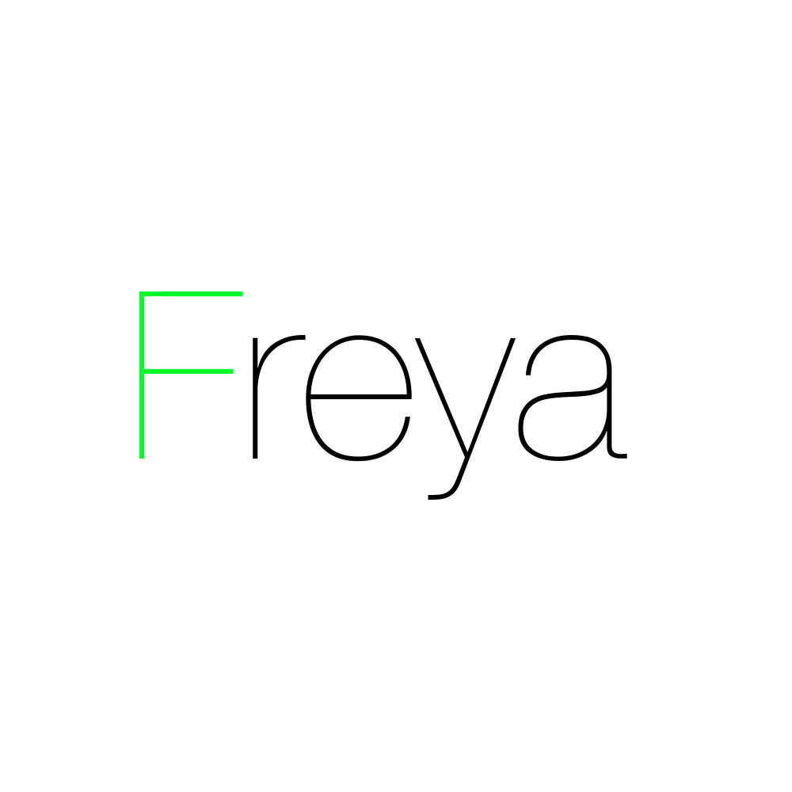

# Freya

[](LICENSE)
[](https://github.com/LombardiDaniel/Freya/tags)
[](https://github.com/LombardiDaniel/Freya/graphs/contributors)
[](https://www.linkedin.com/in/daniel-lombardi-de-oliveira-95b372147/)

<br />
<p align="center">
  <a href="https://github.com/LombardiDaniel/Freya/">
    
  </a>

  <p align="center">
    Freya
    <br />
    <br />
    .
    <a href="https://github.com/LombardiDaniel/Freya/issues">Report Bug</a>
    ·
    <a href="https://github.com/LombardiDaniel/Freya/issues">Request Feature</a>
  </p>
</p>


## Table of Contents

* [About the Project](#about-the-project)
* [Getting Started](#getting-started)
  * [Prerequisites](#prerequisites)
  * [Installation](#installation)
* [Running the tests](#running-the-tests)
  * [Break down into end to end tests](#break-down-into-end-to-end-tests)
* [Deployment](#deployment)
* [Built With](#built-with)
* [Versioning](#versioning)
* [Authors](#authors)
* [License](#license)
* [Acknowledgements](#acknowledgements)

## About the Project

Freya is an autonomous garden built on the Arduino platform, it is capable of a few basic functions and data logging. Built mainly for indoor or outdoor apartment use. The name was inspired by the Titanic Keeper Freya, that resides in the Temple of Life in Northrend, a continent in Azeroth, from the lore of World of Warcraft.

## Getting Started

Everything needed to build Freya using an Arduino Nano can be found in the Circuit.png file, it was built using the open-source software, Fritzing.
About the very own garden structure, it is completely up to the user, pretty much any design will work, as long as the watering tube is capable of delivering water to the soil and the sensors are fitted in it.
On one of my designs, the servo motor used to open/close the hatch is stuck to the side, so it only needs to rotate 180º to completely control the hatch. As for the LEDs, I used a simple, cheap LED strip, to be controlled by a N-channel mosfet.

### Prerequisites

All libraries I used are open-source.
```C++
<DallasTemperature.h>
<DS3231.h>
<OneWire.h>
```
They can be found at:

* [DallasTemperature.h](https://github.com/milesburton/Arduino-Temperature-Control-Library)
* [DS3231.h](http://www.rinkydinkelectronics.com/library.php?id=73)
* [OneWire.h](https://github.com/PaulStoffregen/OneWire)

*All other libraries used come pre-installed with the Arduino IDE*

### Installation

The repository can be cloned via:

```sh
git clone https://github.com/LombardiDaniel/Freya.git
```

After that, just open the code on the [Arduino IDE](https://www.arduino.cc/en/main/software), make sure the pins are correctly connected and you are good.

## Running the tests

There are no tests needed for Freya to work.

Freya does not need any other softwares. Yet, it is recommended (as for data analysis) that you have some sort of spreadsheet software, such as Apple Numbers or Microsoft Excel, in order to organize graphs and files. Or any other will do i.e. Python Math, R etc.

The exported files to the SD card will be named as:

```C++
"Freya_data_" + CURRENT DATE + ".txt"
```

and will have the following organization:
```C++
"TIME,HATCH_STATE,LIGHT,SOIL_TEMPERATURE,SOIL_MOISTURE"
```

However, if you are not using the exact same sensors as me, you should make sure that the readings are still correct.

### Break down into end to end tests

You must be careful as to how the hatch system is built, as most servos can only rotate 180º, that must be taken into consideration, the 'extreme' rotation values (0 and 180) must be aligned to the CLOSED and OPEN position, respectively.
When you run the program, however, the current position does not matter, as it will be rotated on system begin, to open position.
As in:

```C++
for (int pos = 0; pos <= 180; pos++) {
  hatch.write(pos);
  delay(50);
}
hatch_state = "open";
```

## Deployment

Freya is intended to be a cheap autonomous garden, used primarily on apartment verandas. The software is written in C++ Arduino, and has a few sensors in it, that can be used and combined to measure/do what ever the user feels like. There is no Soil Acidity sensor because they can be quite expensive, and therefore, are over the desired budget. It needs one power source (a simple 110V power outlet will do) but needs to be stepped down to 9-12V, to be suitable to the Arduino.

## Built With

* [Atom](http://atom.io/) - The text editor used
* [Arduino IDE](https://www.arduino.cc/en/main/software) - Compile and upload software used
* Various other softwares were used, such as Atom Packages, Github itself and others, they are listed on [Acknowledgements](#acknowledgements)

## Versioning

We use [SemVer](http://semver.org/) for versioning. For the versions available, see the [tags on this repository](https://github.com/LombardiDaniel/Freya/).

## Authors

* **Daniel Lombardi** - *Initial work* - [LombardiDaniel](https://github.com/LombardiDaniel)

See also the list of [contributors](https://github.com/LombardiDaniel/Freya/contributors) who participated in this project.

## License

This project is licensed under the MIT License - see the [LICENSE](LICENSE) file for details.

## Acknowledgements

* [language-arduino](https://atom.io/packages/language-arduino)
* [arduino-upload](https://atom.io/packages/arduino-upload)
* Hat tip to anyone whose code was used
